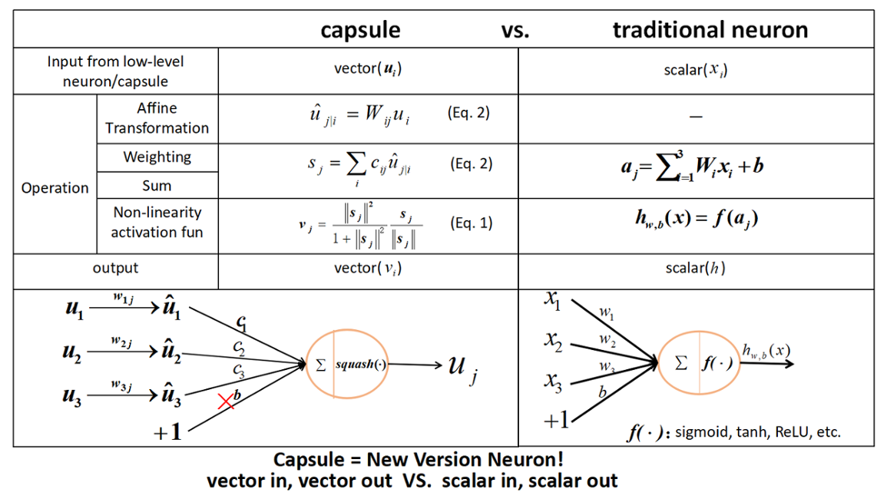
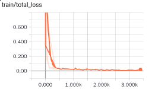
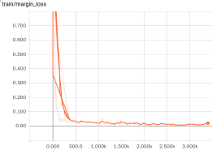
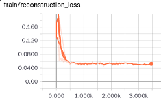
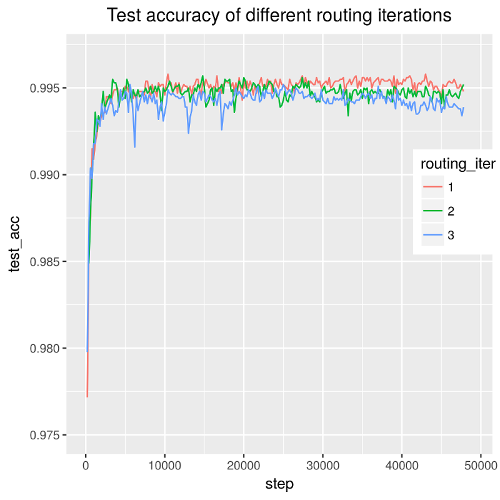

# CapsNet-Tensorflow

[](CONTRIBUTING.md)
[](https://opensource.org/licenses/Apache-2.0)
[](https://gitter.im/CapsNet-Tensorflow/Lobby)

A Tensorflow implementation of CapsNet based on Geoffrey Hinton's paper [Dynamic Routing Between Capsules](https://arxiv.org/abs/1710.09829)



> **Notes:**
> 1. The current version supports [MNIST](http://yann.lecun.com/exdb/mnist/) and [Fashion-MNIST](https://github.com/zalandoresearch/fashion-mnist) datasets. The current test accuracy for MNIST is `99.64%`, and Fashion-MNIST `90.60%`, see details in the [Results](https://github.com/naturomics/CapsNet-Tensorflow#results) section
> 2. See [dist_version](dist_version) for multi-GPU support
> 3. [Here(知乎)](https://zhihu.com/question/67287444/answer/251460831) is an article explaining my understanding of the paper. It may be helpful in understanding the code.


> **Important:**
>
> If you need to apply CapsNet model to your own datasets or build up a new model with the basic block of CapsNet, please follow my new project [CapsLayer](https://github.com/naturomics/CapsLayer), which is an advanced library for capsule theory, aiming to integrate capsule-relevant technologies, provide relevant analysis tools, develop related application examples, and promote the development of capsule theory. For example, you can use capsule layer block in your code easily with the API ``capsLayer.layers.fully_connected`` and ``capsLayer.layers.conv2d``


## Requirements
- Python
- NumPy
- [Tensorflow](https://github.com/tensorflow/tensorflow)>=1.3
- tqdm (for displaying training progress info)
- scipy (for saving images)

## Usage
**Step 1.** Download this repository with ``git`` or click the [download ZIP](https://github.com/naturomics/CapsNet-Tensorflow/archive/master.zip) button.

```
$ git clone https://github.com/naturomics/CapsNet-Tensorflow.git
$ cd CapsNet-Tensorflow
```

**Step 2.** Download [MNIST](http://yann.lecun.com/exdb/mnist/) or [Fashion-MNIST](https://github.com/zalandoresearch/fashion-mnist) dataset. In this step, you have two choices:

- a) Automatic downloading with `download_data.py` script
```
$ python download_data.py   (for mnist dataset)
$ python download_data.py --dataset fashion-mnist --save_to data/fashion-mnist (for fashion-mnist dataset)
```

- b) Manual downloading with `wget` or other tools, move and extract dataset into ``data/mnist`` or ``data/fashion-mnist`` directory, for example:

```
$ mkdir -p data/mnist
$ wget -c -P data/mnist http://yann.lecun.com/exdb/mnist/train-images-idx3-ubyte.gz
$ wget -c -P data/mnist http://yann.lecun.com/exdb/mnist/train-labels-idx1-ubyte.gz
$ wget -c -P data/mnist http://yann.lecun.com/exdb/mnist/t10k-images-idx3-ubyte.gz
$ wget -c -P data/mnist http://yann.lecun.com/exdb/mnist/t10k-labels-idx1-ubyte.gz
$ gunzip data/mnist/*.gz
```

**Step 3.** Start the training(Using the MNIST dataset by default):

```
$ python main.py
$ # or training for fashion-mnist dataset
$ python main.py --dataset fashion-mnist
$ # If you need to monitor the training process, open tensorboard with this command
$ tensorboard --logdir=logdir
$ # or use `tail` command on linux system
$ tail -f results/val_acc.csv
```

**Step 4.** Calculate test accuracy

```
$ python main.py --is_training=False
$ # for fashion-mnist dataset
$ python main.py --dataset fashion-mnist --is_training=False
```

> **Note:** The default parameters of batch size is 128, and epoch 50. You may need to modify the ``config.py`` file or use command line parameters to suit your case, e.g. set batch size to 64 and do once test summary every 200 steps: ``python main.py  --test_sum_freq=200 --batch_size=48``

## Results
The pictures here are plotted by tensorboard and my tool `plot_acc.R`

- training loss





Here are the models I trained and my talk and something else:

[Baidu Netdisk](https://pan.baidu.com/s/1pLp8fdL)(password:ahjs)

- The best val error(using reconstruction)

Routing iteration | 1 | 3 | 4 |
:-----|:----:|:----:|:------|
val error | 0.36 | 0.36 | 0.41 |
*Paper* | 0.29 | 0.25 | - |




> My simple comments for capsule
> 1. A new version neural unit(vector in vector out, not scalar in scalar out)
> 2. The routing algorithm is similar to attention mechanism
> 3. Anyway, a great potential work, a lot to be built upon


## My weChat:
 

### Reference
- [XifengGuo/CapsNet-Keras](https://github.com/XifengGuo/CapsNet-Keras): referred for some code optimizations
