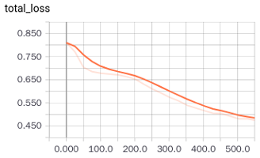
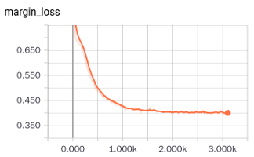
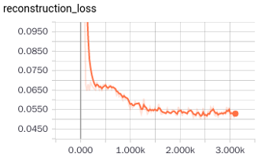
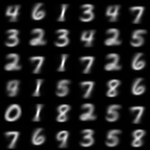
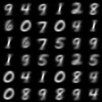
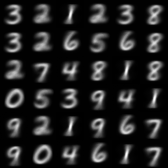
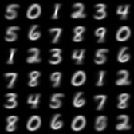

# CapsNet-Tensorflow

[](CONTRIBUTING.md)
[](https://opensource.org/licenses/Apache-2.0)


A Tensorflow implementation of CapsNet based on Geoffrey Hinton's paper [Dynamic Routing Between Capsules](https://arxiv.org/abs/1710.09829)

> **States:**
> 1. The code runs, but still has some differences from the paper. There aren't any logical errors as of now, but there could be errors due to my misunstanding - about the capsule, including the routing "for" loop, margin loss (as pointed out in Issue #8. Thanks for the correction, it was carelessness on my part.)
> 2. Some of the results of the 'incorrect' version have been replaced, but they are not yet as effective as the results in the paper. 

> **Daily task**
> 1. Update the code of routing algorithm
> 2. Adjust margin loss
> 3. Improve the eval pipeline

> **Others**
> 1. [Here(知乎)](https://zhihu.com/question/67287444/answer/251460831) is an answer explaining my understanding of Section 4 of the paper (the core part of CapsNet). It may prove helpful in understanding the code.
> 2. If you find out any problems, please let me know. I will try my best to resolve them ASAP.

In the day of waiting, be patient: Merry days will come, believe. ---- Alexander PuskinIf :blush:


## Chat group:
WeChat: 
Gitter: [](https://gitter.im/CapsNet-Tensorflow/Lobby)
my weChat: 

- We have lots of interesting discussions in the WeChat group, you are welcome to join. **But gitter & English first, please.** Anyway, we will release the discussion results in the name of this group (pointing out the contribution of any contributors)

- If you find out that the Wechat group QR is invalid, add my personal account.


## Requirements
- Python
- NumPy
- [Tensorflow](https://github.com/tensorflow/tensorflow) (I'm using 1.3.0, not yet tested for older versions)
- tqdm (for displaying training progress info)

## Usage

### Training
**Step 1.** 
Clone this repository with ``git``.

```
$ git clone https://github.com/naturomics/CapsNet-Tensorflow.git
$ cd CapsNet-Tensorflow
```

**Step 2.** 
Download the [MNIST dataset](http://yann.lecun.com/exdb/mnist/), ``mv`` and extract it into ``data/mnist`` directory.(Be careful the backslash appeared around the curly braces when you copy the ``wget `` command to your terminal, remove it)

```
$ mkdir -p data/mnist
$ wget -c -P data/mnist http://yann.lecun.com/exdb/mnist/{train-images-idx3-ubyte.gz,train-labels-idx1-ubyte.gz,t10k-images-idx3-ubyte.gz,t10k-labels-idx1-ubyte.gz}
$ gunzip data/mnist/*.gz
```

**Step 3.** 
Start the training:
```
$ pip install tqdm  # install it if you haven't installed yet
$ python train.py
```

the tqdm package is not necessary, just an optional tool for displaying training progress. If you don't want it, change the loop ``for in step ...`` to ``for step in range(num_batch)`` in ``train.py``

### Evaluation
```
$ python eval.py --is_training False
```


## Results
Results for the 'wrong' version (Details in Issue #8):

- training loss





- test acc
|Epoch|49|51|
|:----:|:----:|:--:|
|test acc|94.69|94.71|







------------
Results after fixing Issue #8: 


> My simple comments for capsule
> 1. A new version neural unit(vector in vector out, not scalar in scalar out)
> 2. The routing algorithm is similar to attention mechanism
> 3. Anyway, a work with great potential, a lot to be built upon

------------
### TODO:
- Finish the MNIST version of capsNet (progress:90%)
- Do some different experiments for capsNet:
 * Try using other datasets
 * Adjust the model structure
- There is [another new paper](https://openreview.net/pdf?id=HJWLfGWRb) about capsules(submitted to ICLR 2018), a follow-up of the CapsNet paper.
